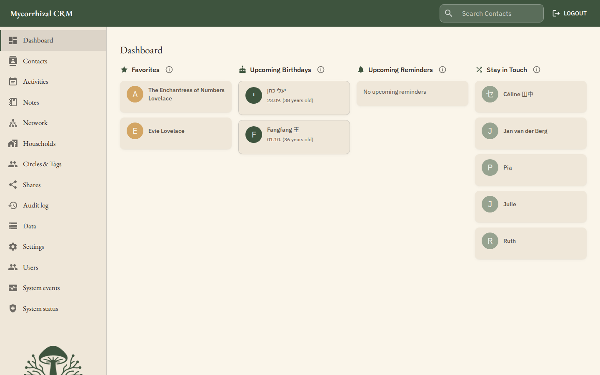
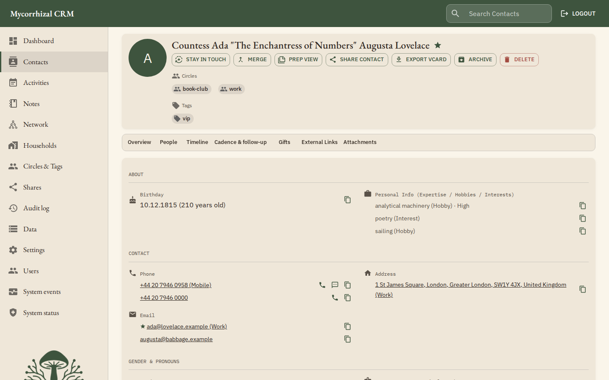
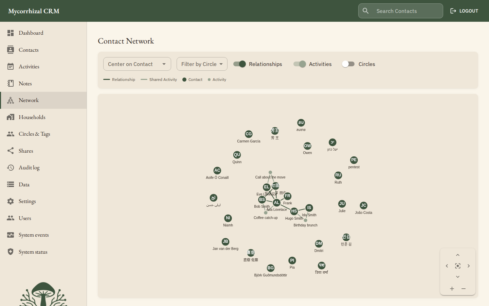
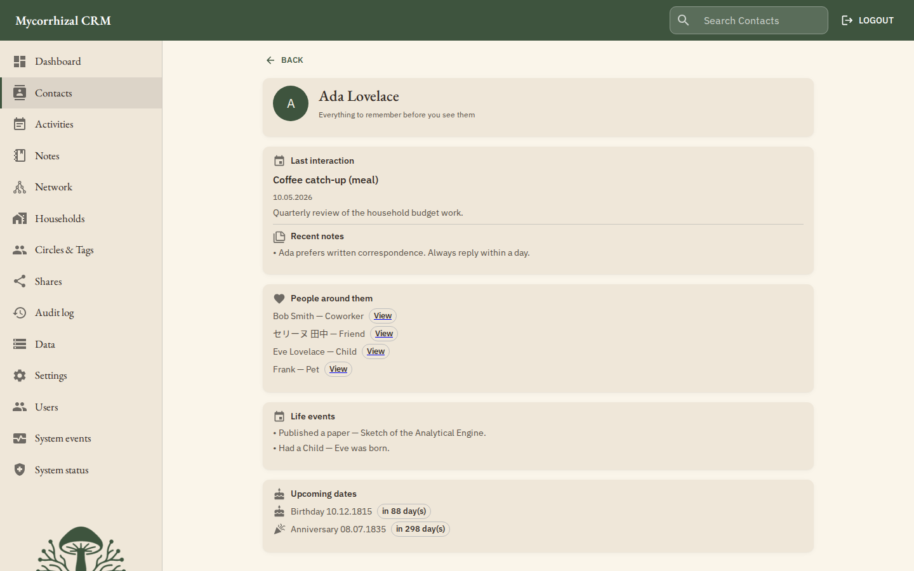

<p align="center">

</p>

# Mycorrhizal CRM

[](https://opensource.org/licenses/MIT)
[](https://github.com/DrewBrunning/mycorrhizal-crm/releases)

[](https://github.com/DrewBrunning/mycorrhizal-crm/actions/workflows/unit-tests.yml)
[](https://codecov.io/gh/DrewBrunning/mycorrhizal-crm)
[](https://scorecard.dev/viewer/?uri=github.com/DrewBrunning/mycorrhizal-crm)
[](https://www.bestpractices.dev/projects/14433)
[](https://www.bestpractices.dev/projects/14433)

[](https://golang.org)
[](https://www.sqlite.org/)
[](https://react.dev)
[](https://www.typescriptlang.org/)
[](https://kotlinlang.org/)
[](https://www.docker.com/)

Mycorrhizal CRM is a self-hosted personal relationship OS: a private, structured place to keep
track of the people (and pets) in your life, and to actually stay in touch with them. It is a fork
of [Meerkat CRM](https://github.com/fbuchner/meerkat-crm) by Frederic Buchner — see
[Related Projects](#related-projects) at the end of this file — but has since grown its own data
model, sync layer and feature set.

## What is Mycorrhizal?

A mycorrhiza is the symbiotic network fungi form with plant roots — an apt name for software whose
whole job is the web of relationships around you. Mycorrhizal is not a social network, a sales
pipeline, or a marketing tool: it's a private, self-hosted address book that also remembers *why*
each person matters to you — how you're connected, when you last talked, what you meant to bring up
next time, and when their birthday is sneaking up.

Everything below is **built and working today** — nothing in this file is aspirational. Planned and
in-progress work lives in [GitHub Issues](https://github.com/DrewBrunning/mycorrhizal-crm/issues),
not here.

<p align="center">

</p>

## Features

### Contacts, circles & tags

Contacts are stored against a neutral, standards-based card model (vCard 3.0/4.0, JSContact, and
CardDAV/CalDAV sync) rather than a proprietary shape, with custom fields and custom vCard mappings
for anything the built-in fields don't cover. **Circles** group the social groups a person belongs
to; **tags** are free-form labels — two distinct, deliberately separate ways to organize the same
contact. Fields can be marked `private` or `secret` to keep them out of external sync, contact
shares and standards exports entirely — your own full CSV backup still contains them, because it's
a backup, not a share. Duplicate contacts merge cleanly, bulk operations apply a circle, tag or
delete across many contacts at once, and SQLite FTS5 full-text search covers contacts, notes and
addresses with relationship-aware synonyms.

<p align="center">

</p>

### Relationships, households & pets

Relationships are bidirectional: connect two contacts once and the reverse relationship (parent →
child, employer → employee, and so on) is derived automatically, which makes relationship-based
search and multi-hop graph traversal possible — explore how you're connected to someone through
intermediaries, not just direct links. Contacts sharing an address are automatically suggested as a
household (confirming or rejecting a suggestion is always your choice), and a household doubles as
a mailing list for invites, cards or gifts. Pets are first-class contacts too, searchable by name
and connected into the same relationship graph as everyone else.

<p align="center">

</p>

### Staying in touch

**Cadence** lets you set how often you intend to be in touch with someone and surfaces who has gone
quiet — it resets on a real interaction, not on ticking off a task. **Favorites** pin your closest
contacts to a dashboard shortlist. Before you see or call someone, **Prep View** pulls together
their recent history, open agenda items and upcoming life events into a single briefing, and a
running **conversation agenda** keeps track of things you meant to raise next time. Reminders can
be delivered by email, [ntfy](https://ntfy.sh), [Gotify](https://gotify.net) or browser push — see
[Notifications](#notifications) below.

<p align="center">

</p>

### Tracking & integrations

Life events beyond birthdays — anniversaries, and anything else worth a reminder — are organized
into categories, and an audit trail records what changed on a contact and when. **Gift tracking**
(modeled after [Monica](https://github.com/monicahq/monica)) covers ideas, gifts given and gifts
received, with notes and links. Contacts can link out to identified faces in an
[Immich](https://github.com/immich-app/immich) instance, to documents in
[Paperless-ngx](https://docs.paperless-ngx.com/), and to files or folders in
[Seafile](https://www.seafile.com/) or [Nextcloud](https://nextcloud.com/)/[ownCloud](https://owncloud.com/)
via WebDAV — all read-only links, so the underlying files always stay on your own server. A
configurable link-type registry lets you deep-link a contact into any other system you run
(`tel:`, `sms:`, WhatsApp, or a type you define yourself).

### Sync & data portability

Contacts and calendars speak CardDAV and CalDAV, so any compatible client can sync against your
instance, and activities/life events can be served as a read-only calendar feed. Exports support
vCard 3.0, vCard 4.0 and JSContact, each with granular, selective field export. **Full backup and
restore** (`make backup`) produces a consistent online SQLite snapshot safe to take while the
server keeps running, with a documented restore procedure covering the database, photos and
attachments together — a scheduled integrity check and a periodic restore drill catch a corrupt or
non-restorable backup long before you'd ever need it (see
[Deployment → Backups](https://drewbrunning.github.io/mycorrhizal-crm/deployment.html#backups)).
**One-time cross-user sharing** lets you hand a specific contact (with granular field selection) to
another user on the same instance as a point-in-time copy, not an ongoing sync.

### Account security

Two-factor authentication (TOTP, RFC 6238) is available as a second factor on interactive login,
with single-use recovery codes for when you lose the device — SSO via OIDC remains available as an
alternative, and CardDAV/API-token auth is unaffected either way.

### Native Android app

A Kotlin/Jetpack Compose client lives in [`android/`](android/): login (including OIDC SSO), a
contact list and detail view with an offline cache and favorites, a tablet two-pane layout, the
dashboard and Prep View, call/SMS tracking with a quick-capture overlay, device-contacts and VCF
import, circles, tags, households, relationships and the network graph, the timeline (life events,
gifts, preferences, agenda), reminders, cadence, contact sharing, the audit trail, push
notifications, and per-user settings.

---

## Notifications

Reminders can be delivered through four channels. Email is configured server-side; the other three
are configured per user, in the app under **Settings → Notifications**, because each user has their
own topic, token and devices.

| Channel | Configured | What you need |
|---|---|---|
| **Email** | Server (`.env`) | Either a [Resend](https://resend.com) API key, or SMTP host/credentials. Both may be set, in which case each email is sent through both. |
| **ntfy** | Per user, in-app | Your ntfy server URL and a topic. Works with the public ntfy.sh or a self-hosted instance. |
| **Gotify** | Per user, in-app | Your Gotify server URL and an application token. The token is stored encrypted at rest. |
| **Browser push** | Per user, in-app | Nothing to configure. The VAPID keypair is generated once on first use and stored in the database. |

`REMINDER_TIME` and `REMINDER_TIMEZONE` control *when* the daily reminder run happens; they apply to every enabled channel, not just email.

The only server-side setting for ntfy/Gotify/push is `WEBHOOK_BLOCK_PRIVATE_URLS`. It defaults to `false` so the server can reach a self-hosted ntfy or Gotify on a private address — set it to `true` on a multi-tenant or cloud deployment, where posting to internal addresses on user-supplied URLs would be an SSRF risk.

> **⚠️ Browser push requires HTTPS.** Push notifications are delivered to a service worker, and browsers refuse to register one on a plain-HTTP origin. `localhost` is exempt, so local testing works, but a LAN deployment reached over `http://` cannot register a device. The other three channels have no such requirement.

Because the app registers a service worker, it is served cache-first. A newly deployed version therefore announces itself with a "new version available" prompt instead of appearing silently — reload when you see it.

---

## Installation

### Docker (Recommended)

Mycorrhizal CRM ships as a single all-in-one image that bundles the frontend and
backend into one container, built locally from source (no published registry
image is required). The easiest way to run it is with Docker Compose:

1. **Download the Docker Compose file:**
    ```sh
    curl -O https://raw.githubusercontent.com/DrewBrunning/mycorrhizal-crm/main/docker-compose.yml
    curl -O https://raw.githubusercontent.com/DrewBrunning/mycorrhizal-crm/main/.env.example
    ```

2. **Configure environment:**
    ```sh
    # Copy the environment template
    cp .env.example .env

    # Edit with your settings
    nano .env
    ```

3. **Build and start the container:**
    ```sh
    docker compose up -d --build
    ```

4. **Access the application:**
    Open http://localhost:7300 in your browser.

Want to see it running with realistic sample data before committing your own? See the
[pen-test / demo environment](docs/development/pentest-environment.md) — one command
(`docker compose -f docker-compose.pentest.yml up -d --build --wait`) brings up the same image
pre-populated with a screenshot-ready dataset and a working login.

## Contributing

Pull requests are welcome. Please read
[`docs/development/contributing.md`](docs/development/contributing.md) first —
one concern per PR, tests with the change, and **every commit signed off**
under the [Developer Certificate of Origin](DCO) (`git commit -s`), which a
required status check enforces. Project roles and who holds access to sensitive
resources are in [`GOVERNANCE.md`](GOVERNANCE.md). Security issues go through
[`SECURITY.md`](SECURITY.md), not a public issue.

### Bugs and feature requests
This application is currently in beta. Bugs are expected in testing, but are hopefully few and far-between. Please submit issues via GitHub.

### Development
To set up this repository for development, follow these steps:

1. **Clone the repository:**
    ```sh
    git clone https://github.com/DrewBrunning/mycorrhizal-crm.git
    cd mycorrhizal-crm
    ```

1. **Run the backend:**
Ensure you have [Go](https://golang.org/doc/install) installed. Then, set up your environment configuration:
   ```sh
    cd backend
    # Copy the example environment file and configure it with your settings
    cp .env.example .env
    
    # Install dependencies and run
    go mod tidy
    source .env
    go run main.go
   ```
   The project uses an SQLite database for storage. Database migrations run automatically on startup.


1. **Run the frontend (in a second terminal):**
   ```sh
   cd frontend

   yarn install
   yarn start
   ```

The exact toolchain versions required to build from source — Go (pinned in
`backend/go.mod`), Node.js and Yarn (`frontend/package.json` `engines`), and the
build tools each layer uses — are documented in
[`docs/development/backend.md`](docs/development/backend.md),
[`docs/development/frontend.md`](docs/development/frontend.md), and
[`docs/development/architecture.md`](docs/development/architecture.md). You can
find a more comprehensive overview for developers in the
[developer README](README-developer.md).

---

## Related Projects

- **[Meerkat CRM](https://github.com/fbuchner/meerkat-crm)** by Frederic Buchner — the project
  Mycorrhizal is forked from, and the reason this repository is MIT-licensed. The schema, sync
  layer and data model have diverged enough since the fork that a direct database migration isn't
  supported, but Mycorrhizal's in-app import assistant can read a Meerkat SQLite database directly
  and map it onto the neutral contact model, showing you a full loss report before anything
  commits — see [the mapping reference](docs/import/meerkat-mapping.md). Ongoing two-way sync
  between the two is also possible over CardDAV.
- **[Monica](https://github.com/monicahq/monica)** — an established personal relationship
  management system that inspired Mycorrhizal's gift-tracking feature. The same import assistant
  can pull an account from a live Monica instance (or a saved snapshot) and map it onto Mycorrhizal
  contacts — see [the mapping reference](docs/import/monica-mapping.md).
